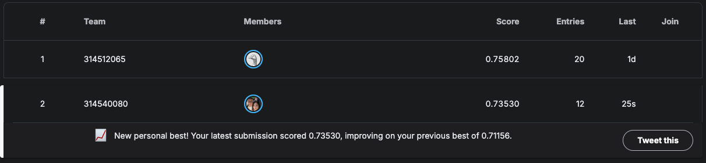

# NYCU LLM Homework 1

Problem 1 identifies the language of a text (English, French, Spanish, Portuguese, German) with character-level
bigram, trigram, RNN and LSTM language models. Problem 2 scores the semantic similarity of patent phrases with a
Transformer encoder written from scratch and submits the predictions to the course Kaggle competition.

## Layout

```
hw1/
├── main.py                     # only Python entry point: subcommands p1, p2, p2-heads
├── requirements.txt
├── data/problem1, data/problem2
├── docs/LLM_hw1.pdf
├── scripts/                    # one .sh per task, each calls main.py
├── tests/                      # pytest, mirrors src/
└── src/
    ├── data/classes/           # Vocabulary, Split, settings, result value objects
    ├── data/loaders/           # csv loading, vocabularies, batching
    ├── interface/              # LanguageModel protocol
    ├── models/                 # n-gram, char RNN/LSTM, Transformer regressor
    ├── services/               # training, evaluation, pipelines, result store
    ├── utils/                  # seed, metrics, timing, plotting, progress, logging, .env
    └── notebooks/              # hw1_1_314540080.ipynb and hw1_2_314540080.ipynb (self-contained, for submission)
```

## Setup

```bash
conda create -n llm-hw1 python=3.11
conda activate llm-hw1
pip install -r requirements.txt
```

## Run

```bash
bash scripts/p1_language_id.sh          # Problem 1, outputs/<date>_p1_language_id/
bash scripts/p2_ensemble_submission.sh  # Problem 2 ensemble + submission.csv, outputs/<date>_p2_v9/
bash scripts/p2_head_comparison.sh      # Problem 2 (c), outputs/<date>_p2_head_comparison/
python -m pytest tests
```

Each script fixes its GPU with `CUDA_VISIBLE_DEVICES`; edit the number in the script to change it. Extra arguments are
forwarded to `main.py`, for example `bash scripts/p1_language_id.sh --epochs 20`. Logs are written to `logs/`.

## Results

### Problem 1: language identification (test set, 700 texts)

RNN and LSTM are implemented from scratch and trained for 40 epochs, keeping the checkpoint with the lowest
validation perplexity for each language.

| Model | Accuracy | Macro-F1 | Val PPL | Test PPL | Train / build time | Peak memory | Inference time |
|---|---|---|---|---|---|---|---|
| Bigram | 0.9729 | 0.9727 | 11.44 | 11.33 | 1.1 s (CPU) | 0.5 MB | 0.81 s |
| Trigram | **0.9871** | **0.9871** | 9.70 | 9.40 | 0.9 s (CPU) | 2.9 MB | 0.78 s |
| RNN | 0.9857 | 0.9857 | 4.62 | **4.42** | 1155 s (GPU) | 190 MB | 1.36 s |
| LSTM | 0.9843 | 0.9842 | 5.10 | 4.91 | 3470 s (GPU) | 632 MB | 3.21 s |

### Problem 2: semantic similarity (Kaggle)

The final submission averages 12 Transformer regressors trained from scratch (validation Pearson 0.6645) and scores
0.68935 on the public leaderboard, ranked first.



## Submission

The two notebooks in `src/notebooks/` are self-contained and are the files to submit as `hw1_314540080.zip`.
